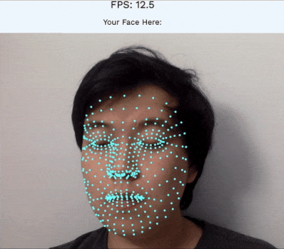

# FaceMeshDemos

Hello! This repository contains the code hosted at [facemeshmedium.netlify.app](https://facemeshmedium.netlify.app/), which are a few MediaPipe Face Mesh demos. Check it out at the link!
Each demo is explained in-depth in the Medium post [here](https://kongmunist.medium.com/face-tracking-with-javascript-on-any-device-with-a-browser-mobile-or-desktop-48aa561fd9d5?) if you want to read about how I did it.

